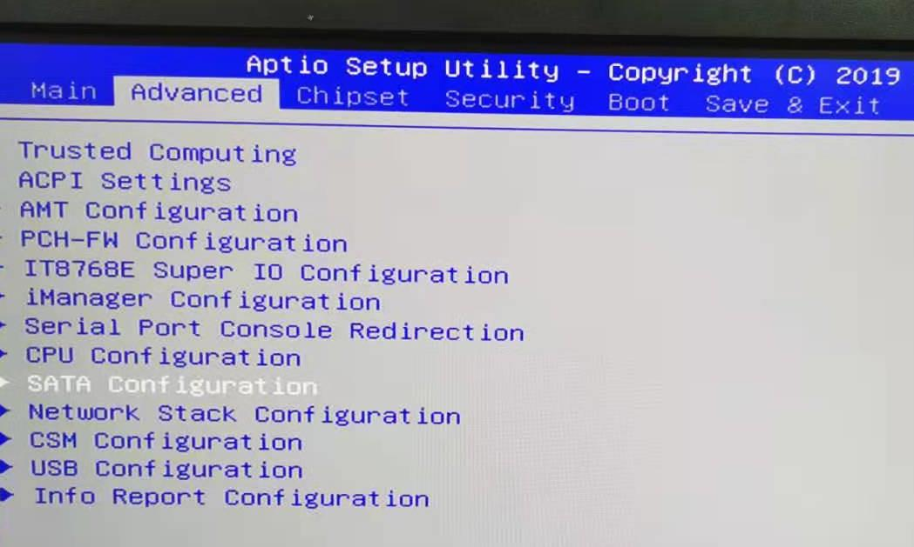
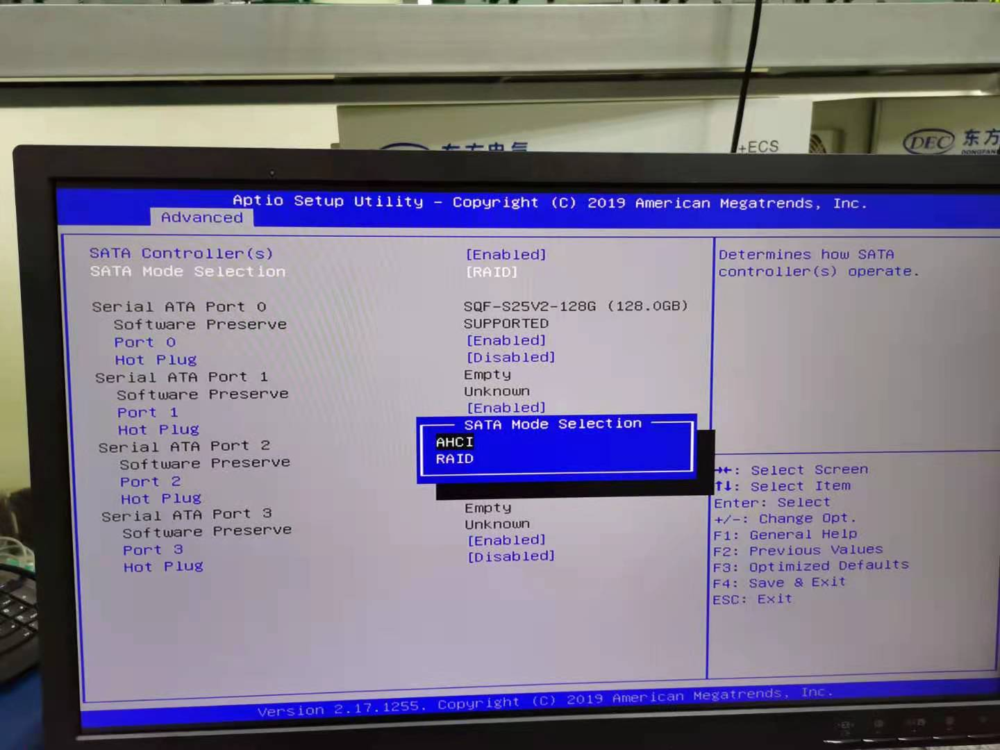
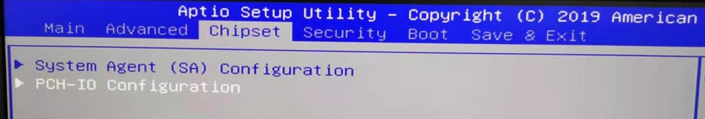
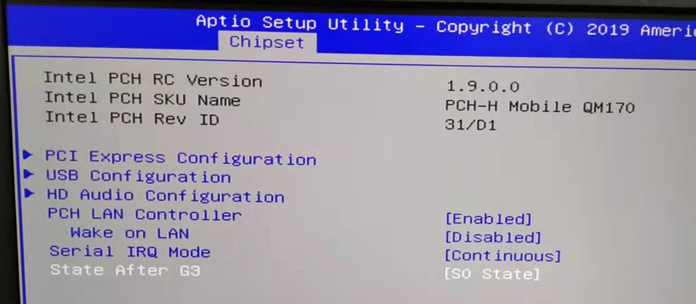
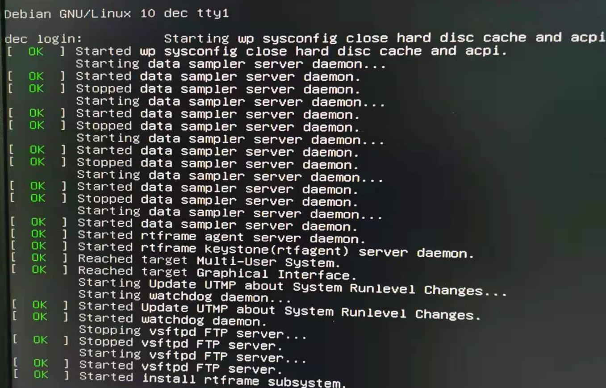
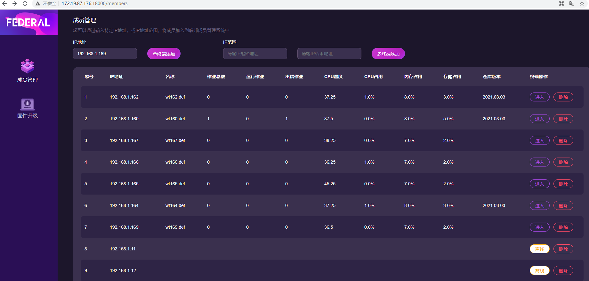
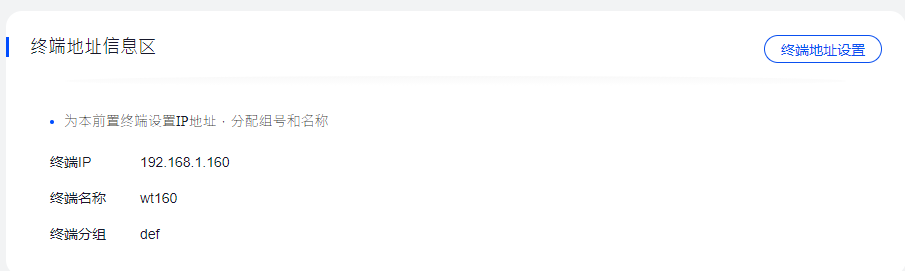

## debian操作系统自动化安装向导

### 1.安装操作系统
确认设备硬盘类型（sda or raid），选择安装光盘；

sda模式:
1、插入U盘，连接显示器、键盘、网线（Lan A）；
2、设备上电，按del键，进入bios模式,选择“Advanced”下面“SATA Configuration”

“SATA Mode Selection”值设置为“AHCI”


3、选择“Chipset”下面“PCH-IO Configuration”下面“State After G3”，修改为“S0 State”；



4 设置Boot，Boot Option #1，选择UEFI：Mass Storage Device 1.00，Partation1；
5 按F4保存退出,点击Yes；
6 自动安装操作系统，完成会自动重启，终端显示如下表示安装完成。



raid模式：
1、插入U盘，连接显示器、键盘、网线（Lan A）；
2、设备上电，不断按del键，进入bios模式；
3、设置Boot，Boot Option #1，选择UEFI：Mass Storage Device 1.00，Partation1；
4、Save and Exit,点击Yes；
5、自动安装操作系统，完成会自动重启，终端显示如下表示安装完成。


### 2.设置终端出厂信息
- 2.1 打开浏览器，访问http://ipaddr:18000/，ipaddr是Federal主机IP。
批量添加终端，如图所示


- 2.2 刷新页面，看到新增加成员(IP小于80)

  


- 2.3 设置终端地址信息
从federal进入终端frame页面，进入-设置-终端地址信息区-终端地址设置，出厂设置如下：
终端IP:IP网段为192.168.1.1~192.168.1.254)
终端名称:wt160,wt161,...依次类推
终端分组为:def


- 2.4 更新应用仓库
从federal进入终端frame页面，进入-dec:aiclab-设置-固件维护区-应用仓库更新-选择文件（E:\zhaolei\wanghao\rtfrep_5.16_2.tgz）-确定上传
设置仓库版本为0516

- 2.5 设置硬件序列号
进入终端frame页面，设置-终端控制区-硬件序列号设置，出厂设置如下：填写标识序列号8221050XXX

- 2.6 重启终端操作系统
进入终端frame页面，设置-终端控制区-操作系统重启

### 3.确认安装成功
- 3.1 测试数据采集
进入终端frame页面，应用仓库-cms_storage-运行-查看流程图-点击cpu-cms.Map-查看计数是否在增加-取消（一定要取消！！！！）。

- 3.2 测试ftp
进入windows命令行(cmd),ftp ip,输入账号:root,密码:aiclab.org,进入ftp,执行下列操作（注意IP！！！）；
```
C:\Users\Administrator>ftp 192.168.1.171
连接到 192.168.1.171。
220 (vsFTPd 3.0.3)
200 Always in UTF8 mode.
用户(192.168.1.171:(none)): root
331 Please specify the password.
密码:
230 Login successful.
ftp>
ftp> mkdir test
257 "/rtfdata/third_party/test" created
ftp> rmdir test
250 Remove directory operation successful.
ftp> bye
221 Goodbye.
```

- 3.3 测试服务启动
ssh dec@IP
dec@IP's password:dec
1、查看服务启动情况，执行以下命令，打印提示如下，即为正常， 
systemctl status sampler
systemctl status keystone
systemctl status rtfagent
systemctl status watchdog
```
Active: active (running)
```
2、查看硬盘状态：
su -
aiclab.org
hdparm -W /dev/sda
```
/dev/sda:
 write-caching =  0 (off)
 ```
3、查看rtfagent版本看是否是v1.0.4
 rtfagent version
 ```
 Version:      v1.0.4
 Git commit:   c3e774d
 Go version:   go1.13.8
 Built:        Sun May 16 11:21:38 CST 2021
 OS/Arch:      linux/amd64
```
退出root,exit
退出dec,logout

- 3.4 贴标签
按照安装记录表内，ip与硬件序列号对应关系贴标签。


### 4.安装失败(federal刷新看不到新装终端)可能的原因

- 1 federal刷新不到终端，没有添加终端IP；
- 2 安装操作系统中断，确认网线连接是否正确，安装阶段报网络错误；
- 3 确认安装版本；
- 4 federal刷新不到终端，在终端输入ip a，查看第2个网卡是否为enp2s0,不是会安装失败

